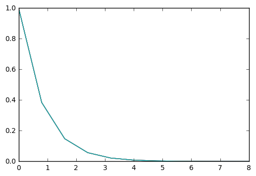
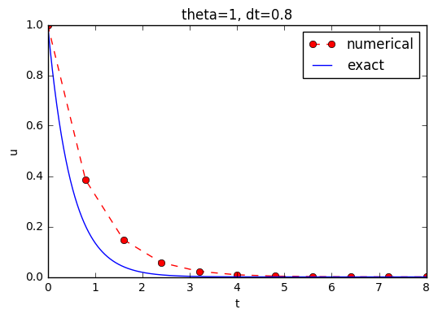

# 1 Algorithms and Implementations
<!-- toc orderedList:0 depthFrom:1 depthTo:6 -->
<!-- tocstop -->


## 1.1 Finite Difference Methods

## 1.2 Implementations

### 1.2.1 Computer Language: Python

### 1.2.2 Making a Solver Function


```python
u, t = solver(I, a, T, dt, theta)
```


```python
from numpy import *
def solver(I, a, T, dt, theta):
    """Solve u'=-a*u, u(0)=I, for t in (0,T] with steps of dt."""
    Nt = int(T/dt)           # no of time intervals
    T = Nt*dt                # adjust T to fit time step dt
    u = zeros(Nt+1)          # array of u[n] values
    t = linspace(0, T, Nt+1) # time mesh

    u[0] = I                 # assign initial condition
    for n in range(0, Nt):   # n=0,1,...,Nt-1
        u[n+1] = (1 - (1-theta)*a*dt)/(1 + theta*dt*a)*u[n]
    return u, t
```

### 1.2.3 Integer Division


```python
from numpy import *
def solver(I, a, T, dt, theta):
    """Solve u’=-a*u, u(0)=I, for t in (0,T] with steps of dt."""
    dt = float(dt)              # avoid integer division
    Nt = int(round(T/dt))       # no of time intervals
    T = Nt*dt                   # adjust T to fit time step dt
    u = zeros(Nt+1)             # array of u[n] values
    t = linspace(0, T, Nt+1)    # time mesh

    u[0] = I                    # assign initial condition
    for n in range(0, Nt):      # n=0,1,...,Nt-1
        u[n+1] = (1 - (1-theta)*a*dt)/(1 + theta*dt*a)*u[n]
    return u, t
```

### 1.2.4 Doc Strings


```python

```

### 1.2.5 Formatting Numbers


```python
# Write out a table of t and u values:
for i in range(len(t)):
    print t[i], u[i]
```


```python
print('t=%6.3f u=%g'%(t[i], u[i]))
```


```python
print('t={t:6.3f} u={u:g}'.format(t=t[i], u=u[i]))
```


```python
print('t={t:6.3f} u={u:g}'.format(t[i], [i]))
```

### 1.2.6 Running the Program


```python
# %load alg/decay_v1.py
from numpy import *

def solver(I, a, T, dt, theta):
    """Solve u'=-a*u, u(0)=I, for t in (0,T] with steps of dt."""
    Nt = int(T/dt)            # no of time intervals
    T = Nt*dt                 # adjust T to fit time step dt
    u = zeros(Nt+1)           # array of u[n] values
    t = linspace(0, T, Nt+1)  # time mesh

    u[0] = I                  # assign initial condition
    for n in range(0, Nt):    # n=0,1,...,Nt-1
        u[n+1] = (1 - (1-theta)*a*dt)/(1 + theta*dt*a)*u[n]
    return u, t

u, t = solver(I=1, a=2, T=8, dt=0.8, theta=1)

# Write out a table of t and u values:
for i in range(len(t)):
    print('t=%6.3f u=%g' % (t[i], u[i]))
    # or print 't={t:6.3f} u={u:g}'.format(t=t[i], u=u[i])

# Plot the solution only
import matplotlib.pyplot as plt
plt.plot(t, u)
plt.show()

```


```python
%run alg/decay_v1.py
```

    t= 0.000 u=1
    t= 0.800 u=0.384615
    t= 1.600 u=0.147929
    t= 2.400 u=0.0568958
    t= 3.200 u=0.021883
    t= 4.000 u=0.00841653
    t= 4.800 u=0.00323713
    t= 5.600 u=0.00124505
    t= 6.400 u=0.000478865
    t= 7.200 u=0.000184179
    t= 8.000 u=7.0838e-05





### 1.2.7 Plotting the Solution


```python
# %load alg/decay_v2.py
from numpy import *

def solver(I, a, T, dt, theta):
    """Solve u'=-a*u, u(0)=I, for t in (0,T] with steps of dt."""
    dt = float(dt)            # avoid integer division
    Nt = int(round(T/dt))     # no of time intervals
    T = Nt*dt                 # adjust T to fit time step dt
    u = zeros(Nt+1)           # array of u[n] values
    t = linspace(0, T, Nt+1)  # time mesh

    u[0] = I                  # assign initial condition
    for n in range(0, Nt):    # n=0,1,...,Nt-1
        u[n+1] = (1 - (1-theta)*a*dt)/(1 + theta*dt*a)*u[n]
    return u, t

def u_exact(t, I, a):
    return I*exp(-a*t)

from matplotlib.pyplot import *

def plot_numerical_and_exact(theta, I, a, T, dt):
    """Compare the numerical and exact solution in a plot."""
    u, t = solver(I=I, a=a, T=T, dt=dt, theta=theta)

    t_e = linspace(0, T, 1001)        # fine mesh for u_e
    u_e = u_exact(t_e, I, a)

    plot(t,   u,   'r--o',            # red dashes w/circles
         t_e, u_e, 'b-')              # blue line for exact sol.
    legend(['numerical', 'exact'])
    xlabel('t')
    ylabel('u')
    title('theta=%g, dt=%g' % (theta, dt))
    savefig('plot_%s_%g.png' % (theta, dt))

plot_numerical_and_exact(I=1, a=2, T=8, dt=0.8, theta=1)
show()

```


```python
%run alg/decay_v2.py
```





### 1.2.8 Verifying the Implementation

### 1.2.9 Computing the Numerical Error as a Mesh Function

### 1.2.10 Computing the Norm of the Error Mesh Function

### 1.2.11 Experiments with Computing and Plotting

### 1.2.12 Memory-Saving Implementation

## 1.3 Exercises

### Exercise 1.1: Define a mesh function and visualize it

### Exercise 1.2: Differentiate a function

### Exercise 1.3: Experiment with divisions

### Exercise 1.4: Experiment with wrong computations

### Exercise 1.5: Plot the error function

### Exercise 1.6: Change formatting of numbers and debug


```python

```