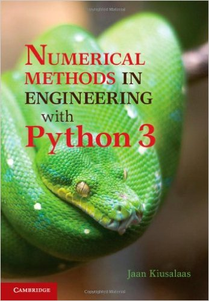

# INFO
  
[link](http://www.cambridge.org/tw/academic/subjects/engineering/engineering-mathematics-and-programming/numerical-methods-engineering-python-3-3rd-edition?format=HB&isbn=9781107033856)

# TOC
* 1 Introduction to Python
  * 1.1 General Information
  * 1.2 Core Python
  * 1.3 Functions and Modules
  * 1.4 Mathematics Modules
  * 1.5 numpy Module
  * 1.6 Plotting with matplotlib.pyplot
  * 1.7 Scoping of Variables
  * 1.8 Writing and Running Programs
* 2 Systems of Linear Algebraic Equations
  * 2.1 Introduction
  * 2.2 Gauss Elimination Method
  * 2.3 LU Decomposition Methods
  * Problem Set 2.1
  * 2.4 Symmetric and Banded Coefficient Matrices
  * 2.5 Pivoting
  * Problem Set 2.2
  * 2.6 Matrix Inversion
  * 2.7 Iterative Methods
  * Problem Set 2.3
  * 2.8 Other Methods
* 3 Interpolation and Curve Fitting
  * 3.1 Introduction
  * 3.2 Polynomial Interpolation
  * 3.3 Interpolation with Cubic Spline
  * Problem Set 3.1
  * 3.4 Least-Squares Fit
  * Problem Set 3.2
* 4 Roots of Equations
  * 4.1 Introduction
  * 4.2 Incremental Search Method
  * 4.3 Method of Bisection
  * 4.4 Methods Based on Linear Interpolation
  * 4.5 Newton-Raphson Method
  * 4.6 Systems of Equations
  * Problem Set 4.1
  * 4.7 Zeros of Polynomials
  * Problem Set 4.2
  * 4.8 Other Methods
* 5 Numerical Differentiation
  * 5.1 Introduction
  * 5.2 Finite Difference Approximations
  * 5.3 Richardson Extrapolation
  * 5.4 Derivatives by Interpolation
  * Problem Set 5.1
* 6 Numerical Integration
  * 6.1 Introduction
  * 6.2 Newton-Cotes Formulas
  * 6.3 Romberg Integration
  * Problem Set 6.1
  * 6.4 Gaussian Integration
  * Problem Set 6.2
  * 6.5 Multiple Integrals
  * Problem Set 6.3
* 7 Initial Value Problems
  * 7.1 Introduction
  * 7.2 Euler's Method
  * 7.3 Runge-Kutta Methods
  * Problem Set 7.1
  * 7.4 Stability and Stiffness
  * 7.5 Adaptive Runge-Kutta Method
  * 7.6 Bulirsch-Stoer Method
  * Problem Set 7.2
  * 7.7 Other Methods
* 8 Two-Point Boundary Value Problems
  * 8.1 Introduction
  * 8.2 Shooting Method
  * Problem Set 8.1
  * 8.3 Finite Difference Method
  * Problem Set 8.2
* 9 Symmetric Matrix Eigenvalue Problems
  * 9.1 Introduction
  * 9.2 Jacobi Method
  * 9.3 Power and Inverse Power Methods
  * Problem Set 9.1
  * 9.4 Householder Reduction to Tridiagonal Form
  * 9.5 Eigenvalues of Symmetric Tridiagonal Matrices
  * Problem Set 9.2
  * 9.6 Other Methods
* 10 Introduction to Optimization
  * 10.1 Introduction
  * 10.2 Minimization Along a Line
  * 10.3 Powell's Method
  * 10.4 Downhill Simplex Method
  * Problem Set 10.1
* Appendices
  * A1 Taylor Series
  * A2 Matrix Algebra
