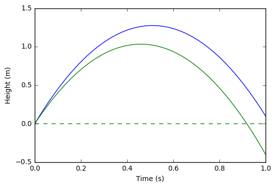

# Ch02 Basic Constructions
<!-- toc orderedList:0 depthFrom:1 depthTo:6 -->

* [Ch02 Basic Constructions](#ch02-basic-constructions)
  * [2.1 If Tests, Colon and Indentation](#21-if-tests-colon-and-indentation)
  * [2.2 Functions](#22-functions)
  * [2.3 For Loops](#23-for-loops)
  * [2.4 While Loops](#24-while-loops)
  * [2.5 Lists and Tuples – Alternatives to Arrays](#25-lists-and-tuples-alternatives-to-arrays)
  * [2.6 Reading from and Writing to Files](#26-reading-from-and-writing-to-files)
  * [2.7 Exercises](#27-exercises)

<!-- tocstop -->

## 2.1 If Tests, Colon and Indentation

## 2.2 Functions


```python
# %load py/ball_function.py
def y(t):
v0 = 5                    # Initial velocity
g = 9.81                  # Acceleration of gravity
return v0*t - 0.5*g*t**2

time = 0.6       # Just pick one point in time
print(y(time))
time = 0.9       # Pick another point in time
print(y(time))

```


```python
%run py/ball_function.py
```

1.2342
0.5269499999999994


```python
# %load py/ball_position_xy.py
def y(v0y, t):
g = 9.81                  # Acceleration of gravity
return v0y*t - 0.5*g*t**2

def x(v0x, t):
return v0x*t

initial_velocity_x = 2.0
initial_velocity_y = 5.0

time = 0.6       # Just pick one point in time
print(x(initial_velocity_x, time), y(initial_velocity_y, time))

time = 0.9       # ... Pick another point in time
print(x(initial_velocity_x, time), y(initial_velocity_y, time))
```


```python
%run py/ball_position_xy.py
```

1.2 1.2342
1.8 0.5269499999999994


```python
# %load py/function_as_argument.py
def sum_xy(x, y):
return x + y

def prod_xy(x, y):
return x*y

def treat_xy(f, x, y):
return f(x, y)

x = 2;  y = 3

print(treat_xy(sum_xy, x, y))
print(treat_xy(prod_xy, x, y))
```


```python
%run py/function_as_argument.py
```

5
6


## 2.3 For Loops


```python
# %load py/ball_max_height.py
import matplotlib.pyplot as plt
import numpy as np

v0 = 5                    # Initial velocity
g = 9.81                  # Acceleration of gravity
t = np.linspace(0, 1, 1000)  # 1000 points in time interval
y = v0*t - 0.5*g*t**2     # Generate all heights

# At this point, the array y with all the heights is ready.
# Now we need to find the largest value within y.

largest_height = y[0]          # Starting value for search
for i in range(1, 1000):
if y[i] > largest_height:
largest_height = y[i]

print("The largest height achieved was %f m" % (largest_height))

# We might also like to plot the path again just to compare
plt.plot(t,y)
plt.xlabel('Time (s)')
plt.ylabel('Height (m)')

```


```python
%run py/ball_max_height.py
```

The largest height achieved was 1.274210 m


## 2.4 While Loops


```python
# %load py/ball_time.py
from numpy import linspace

v0 = 4.5                  # Initial velocity
g = 9.81                  # Acceleration of gravity
t = linspace(0, 1, 1000)  # 1000 points in time interval
y = v0*t - 0.5*g*t**2     # Generate all heights

# Find where the ball hits y=0
i = 0
while y[i] >= 0:
i += 1

# Now, y[i-1]>0 and y[i]<0 so let's take the middle point
# in time as the approximation for when the ball hits h=0
print("y=0 at", 0.5*(t[i-1] + t[i]))

# We plot the path again just for comparison
import matplotlib.pyplot as plt
plt.plot(t, y)
plt.plot(t, 0*t, 'g--')
plt.xlabel('Time (s)')
plt.ylabel('Height (m)')
plt.show()

```


```python
%run py/ball_time.py
```

y=0 at 0.917417417417





## 2.5 Lists and Tuples – Alternatives to Arrays


```python
x = ['hello' , 4, 3.14, 6]
```


```python
x = ['hello' , 4, 3.14, 6]
x.insert(0, -2) # x then becomes [-2, ’hello’, 4, 3.14, 6]
del x[3]        # x then becomes [-2, ’hello’, 4, 6]
x.append(3.14)  # x then becomes [-2, ’hello’, 4, 6, 3.14]
```


```python
x = ['hello' , 4, 3.14, 6]
for e in x:
print('x element: ' , e)
print('This was all the elements in the list x')
```

x element:  hello
x element:  4
x element:  3.14
x element:  6
This was all the elements in the list x


```python
List_1 = [1, 2, 3, 4]
List_1
```


[1, 2, 3, 4]


```python
List_2 = [e*10 for e in List_1]
List_2
```


[10, 20, 30, 40]


```python
List_2 = [E(e) for e in List_1]
List_2
```


```python
x = ('hello' , 4, 3.14, 6)
for e in x:
print('x element: ' , e)
print('This was all the elements in the tuple x')
```

x element:  hello
x element:  4
x element:  3.14
x element:  6
This was all the elements in the tuple x


## 2.6 Reading from and Writing to Files


```python
# %load py/file_handling.py
filename = 'tmp.dat'
infile = open(filename, 'r')  # Open file for reading
line = infile.readline()      # Read first line
# Read x and y coordinates from the file and store in lists
x = []
y = []
for line in infile:
words = line.split()      # Split line into words
x.append(float(words[0]))
y.append(float(words[1]))
infile.close()

# Transform y coordinates
from math import log

def f(y):
return log(y)

for i in range(len(y)):
y[i] = f(y[i])

# Write out x and y to a two-column file
filename = 'tmp_out.dat'
outfile = open(filename, 'w')  # Open file for writing
outfile.write('# x and y coordinates\n')
for xi, yi in zip(x, y):
outfile.write('%10.5f %10.5f\n' % (xi, yi))
outfile.close()


```


```python
%run py/file_handling.py
```


```python
# %load py/file_handling_numpy.py
filename = 'tmp.dat'
import numpy
data = numpy.loadtxt(filename, comments='#')
x = data[:,0]
y = data[:,1]
data[:,1] = numpy.log(y)  # insert transformed y back in array
filename = 'tmp_out.dat'
filename = 'tmp_out.dat'
outfile = open(filename, 'w')  # open file for writing
outfile.write('# x and y coordinates\n')
numpy.savetxt(outfile, data, fmt='%10.5f')


```


```python
%run py/file_handling_numpy.py
```

## 2.7 Exercises

* Exercise 2.1: Errors with colon, indent, etc.
* Exercise 2.2: Compare integers a and b
* Exercise 2.3: Functions for circumference and area of acircle
* Exercise 2.4: Function for area of arectangle
* Exercise 2.5: Area of apolygon
* Exercise 2.6: Average of integers
* Exercise 2.7: While loop with errors
* Exercise 2.8: Area of rectangle versus circle
* Exercise 2.9: Find crossing points of two graphs
* Exercise 2.10: Sort array with numbers
* Exercise 2.11: Compute
* Exercise 2.12: Compute combinations of sets
* Exercise 2.13: Frequency of random numbers
* Exercise 2.14: Game21
* Exercise 2.15: Linear interpolation
* Exercise 2.16: Test straight line requirement
* Exercise 2.17: Fit straight line to data
* Exercise 2.18: Fit sines to straightline
* Exercise 2.19: Count occurrences of a string in a string


```python

```
