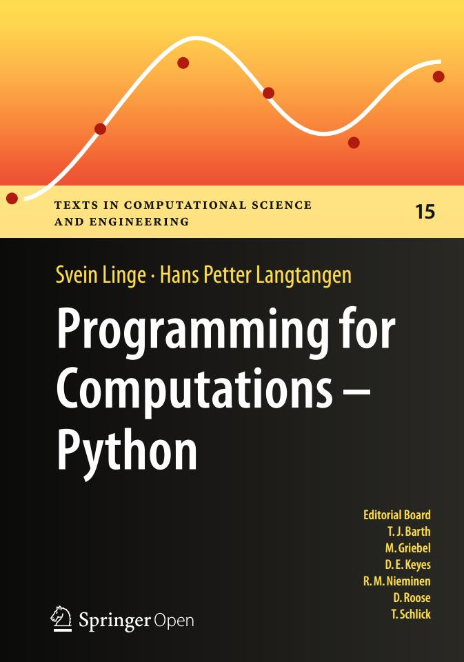

# Programming for Computations – Python

# Info
[Springer](http://www.springer.com/gp/book/9783319324272)
[github](https://github.com/hplgit/prog4comp)

# Toc
* Ch01 The First Few Steps  
* Ch02 Basic Constructions  
* Ch03 Computing Integrals  
* Ch04 Solving Ordinary Differential Equations  
* Ch05 Solving Partial Differential Equations  
* Ch06 Solving Nonlinear Algebraic Equations  
* AppA Getting Access to Python  
